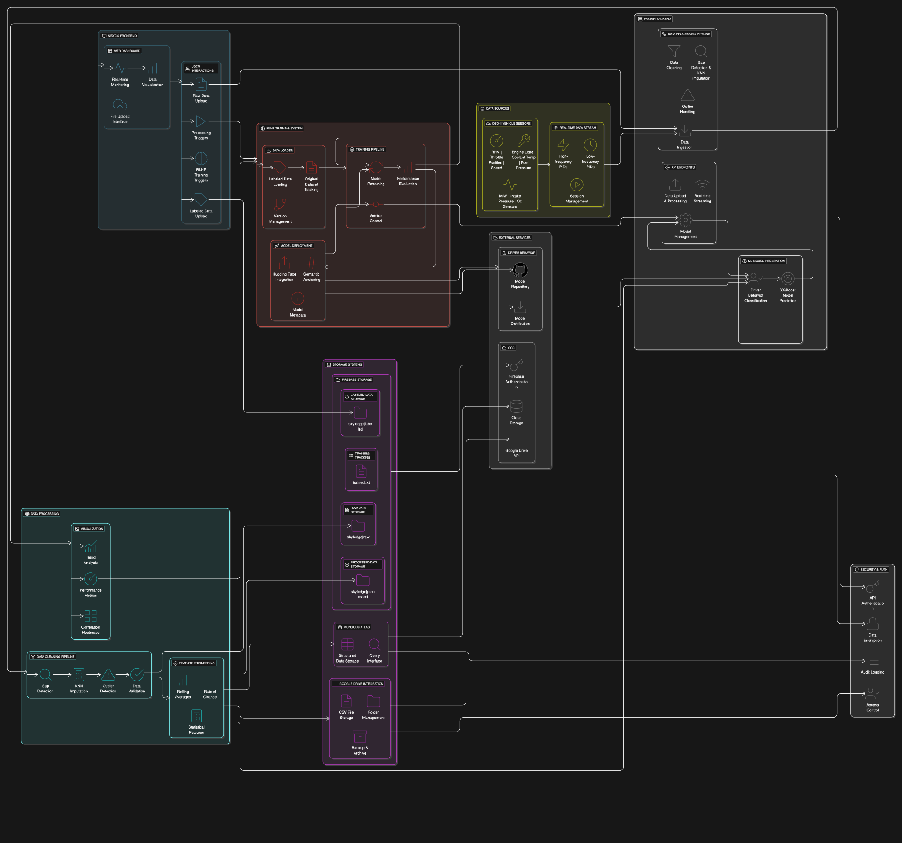

# OBD Logger

A comprehensive OBD-II data logging and processing system built with FastAPI, featuring advanced data cleaning, Google Drive integration, MongoDB storage capabilities, and **Reinforcement Learning from Human Feedback (RLHF)** for driver behavior classification.



## Features

- **Real-time OBD-II Data Ingestion**: Stream and process OBD sensor data in real-time
- **Advanced Data Cleaning**: Intelligent gap detection, KNN imputation, and outlier handling
- **Multi-Storage Architecture**: 
  - Google Drive integration for CSV storage
  - Firebase for structured data storage and querying
  - MongoDB Atlas for structured data storage and querying
- **Driver Behavior Classification**: XGBoost-based ML model for driving style prediction
- **RLHF Training System**: Continuous model improvement through human feedback
- **Data Visualization**: Automatic generation of correlation heatmaps and trend plots
- **RESTful API**: Comprehensive endpoints for data management and retrieval
- **Web Dashboard**: User-friendly interface for monitoring and control
- **Model Versioning**: Semantic versioning (1.0, 1.1, 1.2, etc.) with Hugging Face integration

## Architecture

The application is structured into modular components:

- **`app.py`**: Main FastAPI application with data processing pipeline and RLHF endpoints
- **`data/`**: Storage and persistence modules
  - **`drive_saver.py`**: Google Drive operations and file management
  - **`mongo_saver.py`**: MongoDB operations and data persistence
  - **`firebase_saver.py`**: Firebase operations and data persistence
- **`train/`**: RLHF training system
  - **`loader.py`**: Load labeled data from Firebase storage with original dataset tracking
  - **`saver.py`**: Save trained models to Hugging Face Hub with semantic versioning
  - **`rlhf.py`**: Main RLHF training pipeline for continuous model improvement
- **`OBD/`**: OBD-specific modules for data analysis and logging
- **`utils/`**: Utility modules for model management and data processing

## Quick Start

1. **Install Dependencies**:
   ```bash
   pip install -r requirements.txt
   ```

2. **Set Environment Variables**:
   - `GDRIVE_CREDENTIALS_JSON`: Google Service Account credentials
   - `FIREBASE_SERVICE_ACCOUNT_JSON`: Firebase connection string
   - `FIREBASE_ADMIN_JSON`: Firebase Admin SDK credentials
   - `HF_TOKEN`: Hugging Face authentication token
   - `HF_MODEL_REPO`: Hugging Face model repository (default: `BinKhoaLe1812/Driver_Behavior_OBD`)
   - `MODEL_DIR`: Local model directory (default: `/app/models/ul`)

3. **Run the Application**:
   ```bash
   uvicorn app:app --reload
   ```

4. **Access the Dashboard**:
   - Web UI: `http://localhost:8000/ui`
   - API Docs: `http://localhost:8000/docs`

## Data Processing Pipeline

1. **Ingestion**: Real-time streaming or bulk CSV upload
2. **Cleaning**: Automatic gap detection and KNN imputation
3. **Feature Engineering**: Derived metrics and sensor combinations
4. **Storage**: Simultaneous save to Google Drive, Firebase, and MongoDB
5. **Driver Behavior Classification**: XGBoost model prediction on processed data
6. **RLHF Training**: Continuous model improvement through human feedback
7. **Visualization**: Correlation analysis and trend plots

## API Endpoints

### Data Ingestion
- `POST /ingest`: Stream OBD data
- `POST /upload-csv/`: Bulk CSV upload

### Data Retrieval
- `GET /download/{filename}`: Download cleaned CSV
- `GET /events`: Get processing status

### MongoDB Operations
- `GET /mongo/status`: Check MongoDB connection
- `GET /mongo/sessions`: Get data session summaries
- `GET /mongo/query`: Query data with filters
- `POST /mongo/save-csv`: Direct CSV to MongoDB

### RLHF Training System
- `POST /rlhf/train`: Trigger RLHF training session
- `GET /rlhf/status`: Get RLHF system status and available labeled data
- `GET /rlhf/trained-datasets`: List datasets already used for training


### Firebase Storage
- Structured data storage with automatic versioning
- **`skyledge/raw/`**: Original OBD data files
- **`skyledge/processed/`**: Cleaned and processed data
- **`skyledge/labeled/`**: Human-labeled data for RLHF training
- **`skyledge/labeled/trained.txt`**: Tracks processed datasets to avoid retraining

### Hugging Face Hub
- **Model Repository**: `BinKhoaLe1812/Driver_Behavior_OBD`
- **Semantic Versioning**: v1.0, v1.1, v1.2, ..., v2.0, etc.
- **Model Components**: XGBoost model, label encoder, scaler
- **Metadata**: Training logs, performance metrics, dataset information

## RLHF Training System

### Overview
The Reinforcement Learning from Human Feedback (RLHF) system enables continuous improvement of the driver behavior classification model through human-labeled data.

### Key Features
- **Original Dataset Tracking**: Automatically links labeled data to original datasets
- **Preference Learning**: Learns from differences between model predictions and human labels
- **Semantic Versioning**: Automatic model versioning (1.0 → 1.1 → 1.2 → 2.0)
- **Hugging Face Integration**: Saves models to HF Hub with metadata
- **Training Tracking**: Prevents retraining on the same datasets

### Usage Examples

#### Trigger RLHF Training
```bash
curl -X POST "http://localhost:8000/rlhf/train" \
     -H "Content-Type: application/json" \
     -d '{
       "max_datasets": 5,
       "force_retrain": false
     }'
```

#### Check Training Status
```bash
curl -X GET "http://localhost:8000/rlhf/status"
```

#### List Trained Datasets
```bash
curl -X GET "http://localhost:8000/rlhf/trained-datasets"
```

### Data Flow
1. **Human Labeling**: Data labeled and stored in `skyledge/labeled/`
2. **Filename Convention**: `001_raw-002_2025-09-19-labelled.csv`
3. **Original Dataset**: Automatically loads `skyledge/raw/002_2025-09-19-raw.csv`
4. **RLHF Training**: Compares model predictions vs human labels
5. **Model Update**: Trains new model with preference learning
6. **Versioning**: Saves as v1.0, v1.1, etc. to Hugging Face Hub

## Documentation

- **MongoDB Setup**: See `MONGODB_SETUP.md` for detailed configuration
- **Google Drive Setup**: See `GOOGLE_DRIVE_SETUP.md` for configuration
- **RLHF Training**: See `train/README.md` for detailed RLHF documentation
- **API Reference**: Interactive docs at `/docs` endpoint
- **Code Structure**: Modular design for easy maintenance

## Development

The codebase follows clean architecture principles:
- **Separation of concerns**: Between storage, processing, API, and ML layers
- **Comprehensive error handling**: Graceful fallbacks for service unavailability
- **Type hints and documentation**: Full type annotations and docstrings
- **Modular design**: Easy to extend and maintain
- **RLHF Integration**: Seamless integration of machine learning with data processing
- **Version control**: Semantic versioning for model artifacts
- **Testing**: Comprehensive test coverage for all components

## Model Management

### Driver Behavior Classification
- **Model Type**: XGBoost Classifier
- **Labels**: Aggressive, Normal, Conservative
- **Features**: OBD sensor data (speed, RPM, throttle, etc.)
- **Training**: RLHF with human feedback integration

### Model Artifacts
- **XGBoost Model**: `xgb_drivestyle_ul.pkl`
- **Label Encoder**: `label_encoder_ul.pkl`
- **Feature Scaler**: `scaler_ul.pkl`
- **Metadata**: Training logs and performance metrics

### Versioning Strategy
- **Semantic Versioning**: 1.0 → 1.1 → 1.2 → 2.0
- **Automatic Detection**: Checks existing versions in HF repo
- **Fallback**: Timestamp-based versioning if HF unavailable
- **Local Backup**: Saves to local `/app/models/ul/v{version}/`

## License

Apache 2.0 License
